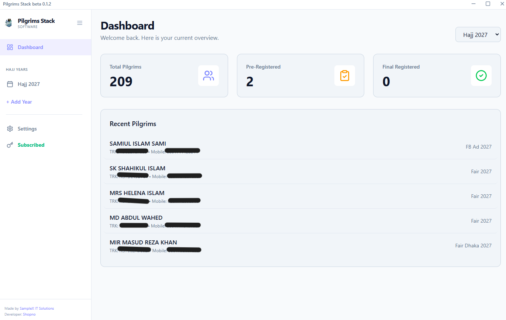
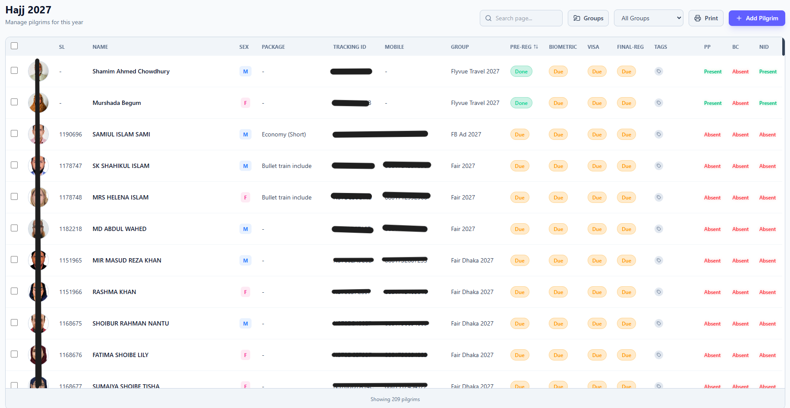
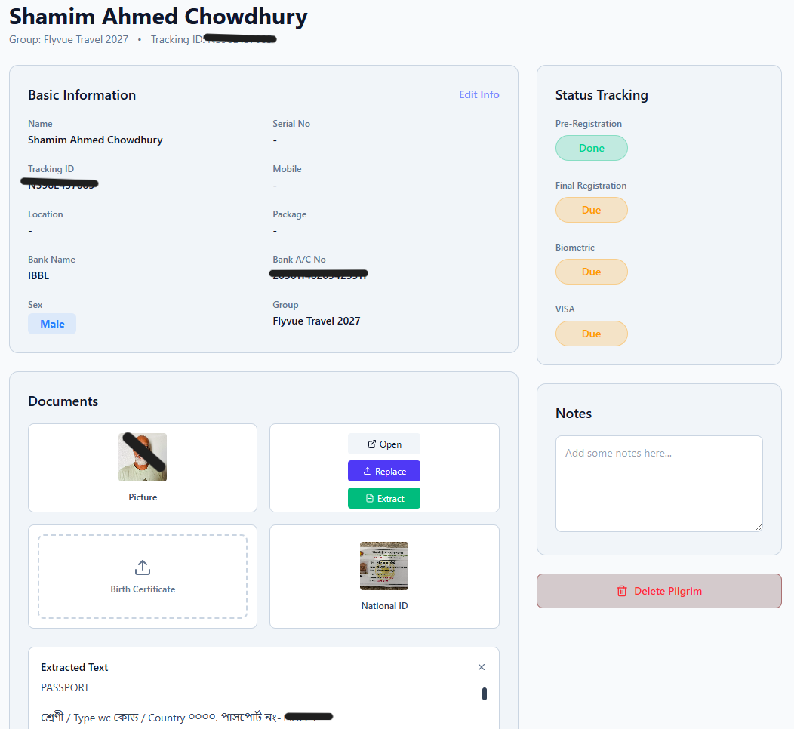
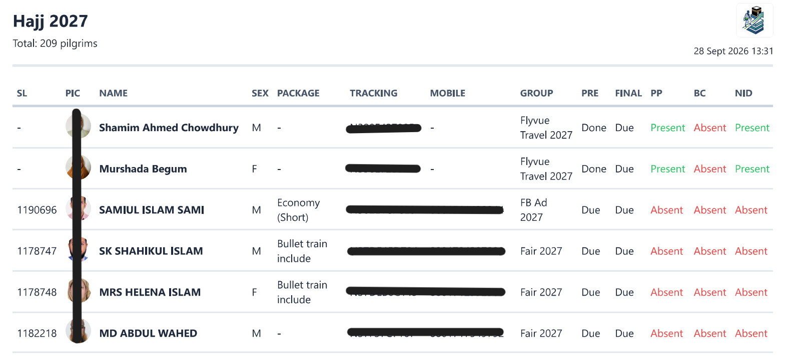
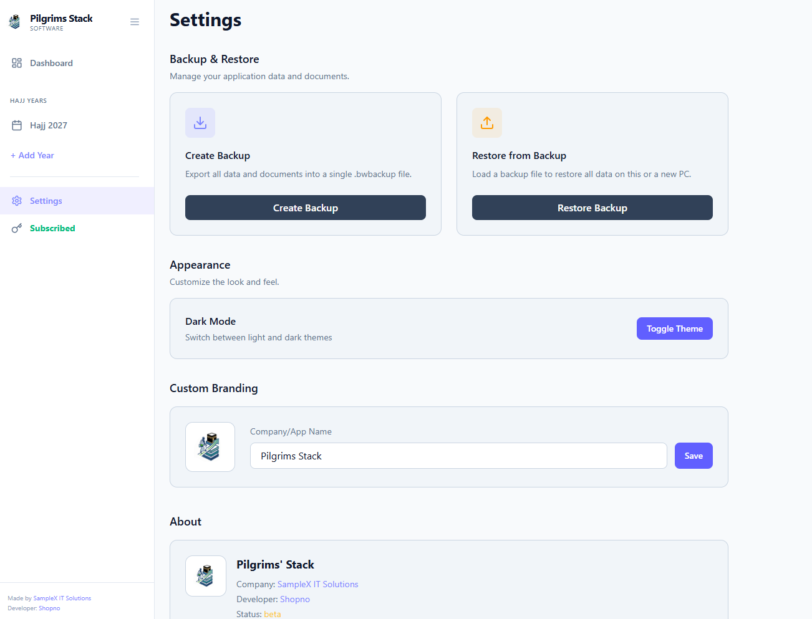

  

<h1 align="center">Pilgrims' Stack</h1>

  <strong>An all-in-one, fully offline desktop software built to help Hajj & Umrah agencies securely manage pilgrim registrations, visas, and documentation.</strong>

  
  
  
  

  

---

## 📖 Overview

**Pilgrims' Stack** is a high-performance desktop application designed specifically to eliminate paperwork chaos, lost documents, and sluggish spreadsheets for Hajj & Umrah agencies. It keeps all your pilgrim records, status workflows, passport scans, and photos organized within a blazing-fast, completely offline environment.

---

## ✨ Key Features

- 🔒 **100% Offline & Private:** All pilgrim data and attached document files are stored strictly on your local machine. No external servers, no cloud leaks, zero internet dependency.
- 🔍 **Enhanced OCR Document Text Extraction:** Built-in document recognition tailored for Passports, National IDs (NID), and Birth Certificates. Features specialized Sparse Text Recognition (PSM 11) for Bangla, English, and numbers with intelligent noise filtration and clean text formatting.
- ⚡ **Single-Click Status Workflow:** Instantly toggle stages for **Pre-Registration**, **Biometrics**, **VISA**, and **Final Registration** (Due / Done / Out) without typing.
- 👥 **One-Click Gender (M/F) Toggling:** Switch gender classifications instantly from the list view or profile page with single-click actions and full bulk-update support.
- 🏷️ **Bulk Actions & Tagging System:** Multi-select pilgrims to batch-update status flags, assign custom color-coded agency tags, or manage records in bulk.
- 📁 **Complete Document Vault:** Upload, organize, preview, and access Profile Pictures, Passports, Birth Certificates, and NID cards directly in one place.
- 🖨️ **Embassy-Ready Printable Reports:** Generate clean, formatted printable tables of your pilgrim rosters—complete with photos, tracking IDs, and serial numbers—ready for official agency and embassy submissions.
- 💾 **Safe Backup & Restore:** Package your entire database and all document files into a portable standalone `.bwbackup` archive to seamlessly migrate or restore to any PC.

---

## 📸 Interface Preview

### 1. Pilgrim Management & Status Tracking

 
<em>Intuitive table view with real-time search, group filtering, multi-selection, and quick status toggles.</em>

  

### 2. Pilgrim Profile & Document Vault

 
<em>Detailed view for managing personal records, packages, notes, and attached documents with instant OCR text extraction.</em>

  

### 3. Printable Reports & Embassy Exports

 
<em>Standardized, print-optimized document view with embedded photos, verified tracking numbers, and agency headers.</em>

  

### 4. Settings & Backup Center

 
<em>One-click complete database & document backup, restore tools, agency branding, and license verification.</em>

---

## 💻 System Requirements

| Requirement | Specification |
| :--- | :--- |
| **Operating System** | Windows 10 or Windows 11 (64-bit) |
| **Processor** | Intel Core i3 / AMD Ryzen 3 or higher |
| **RAM** | 4 GB minimum (8 GB recommended) |
| **Disk Space** | ~250 MB for installation (+ local storage for uploaded docs) |
| **Internet** | Not required (100% offline operation) |

---

## 🚀 Download & Installation

*Note: Pilgrims' Stack is a closed-source commercial product. Source code is not included in this repository.*

1. Navigate to the **[Releases](../../releases)** page of this GitHub repository.
2. Download the latest installer: **`Pilgrims' Stack Setup 0.1.3.exe`**.
3. Double-click the installer and follow the on-screen setup instructions.
4. Launch **Pilgrims' Stack** from your Desktop or Start Menu.
5. Enter your license key to activate full access.

---

## 💳 Subscription Packages

Pilgrims' Stack operates on a straightforward commercial model with zero hidden charges:

| Package | Duration | Price | Highlights |
| :--- | :---: | :---: | :--- |
| **AMANAH** | 6 Months | ৳ 4,500 | Full access, unlimited records, local storage & updates |
| **BARAKAH** | 1 Year | ৳ 8,000 | **Best Value** — Priority support, full year uninterrupted access |

👉 To review detailed package information or purchase a key, visit the **[Pricing Page](https://www.samplex.rf.gd/pricing/pilgrimsstack.html)**.

---

## 🔗 Important Links

- 🌐 **Official Website:** [samplex.rf.gd](https://samplex.rf.gd/)
- 🏷️ **Pricing & Features:** [Pricing Page](https://www.samplex.rf.gd/pricing/pilgrimsstack.html)
- 📜 **Privacy Policy:** [Read Privacy Policy](https://www.samplex.rf.gd/pricing/pilgrimsstack.html#privacy)
- ⚖️ **Terms & Conditions:** [Read Terms & Conditions](https://www.samplex.rf.gd/pricing/pilgrimsstack.html#terms)
- 💬 **Live Support & Sales:** [Chat on WhatsApp (+8801576672978)](https://wa.me/8801576672978)

---

## 👨‍💻 Developer & Agency Information

Developed and maintained by **SampleX IT Solutions**:

- **Company:** [SampleX IT Solutions](https://samplex.rf.gd/)
- **Developer:** [Shopno](https://github.com/shopn0/)
- **Direct WhatsApp:** [+880 1576-672978](https://wa.me/8801576672978)

---

  © 2026 SampleX IT Solutions. All rights reserved.

